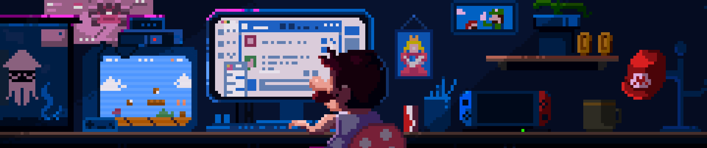

</img>

# 👨‍💻 Nevil Patel

### Full-Stack Developer | AI/ML Engineer | DevOps Engineer

---

## 💻 Tech Arsenal

<b>Frontend</b>

 

<b>Backend & Database</b>

 

<b>🤖 AI/ML & Data Science</b>

 

**Languages & Core Libraries:**

**Machine Learning & Deep Learning:**

**Data Analysis & Visualization:**

**Certifications:**
- 🎓 [Data Literacy](https://www.datacamp.com/skill-verification/DL0031253154490) - DataCamp
- 🎓 [AI Fundamentals](https://www.datacamp.com/skill-verification/AIF0023781553894) - DataCamp
- 🎓 [AI Engineer for Data Scientists Associate](https://www.datacamp.com/certificate/AEDS0012346953105) - DataCamp

<b>Cloud & DevOps</b>

 

**Certifications:**
- ☁️ [Microsoft Azure AZ-900 Certified](https://learn.microsoft.com/api/credentials/share/en-us/PatelNevilDineshkumarStudent-8081/EF7920F8A3084D0?sharingId) - Microsoft

<b>Tools & Others</b>

 

---

---

## 🌟 Recent Activity

<!--START_SECTION:activity-->
<!--END_SECTION:activity-->

---

## 📬 Get In Touch

💼 Actively seeking **Full-Stack Developer | DevOps | AI/ML Engineer** roles  
🌍 Open to opportunities across **Canada** (Remote/Hybrid/Onsite)  
🤖 Interested in roles combining **Web/Mobile Development** with **AI/ML**  
📧 Best way to reach me: [contact@nevilpatel.com](mailto:contact@nevilpatel.com)  
🔗 Let's connect: [LinkedIn](https://www.linkedin.com/in/nevil-patel-262a74265/)

---

  
**"I build intelligent applications that solve real problems, integrate AI/ML capabilities, and scale in production."**

